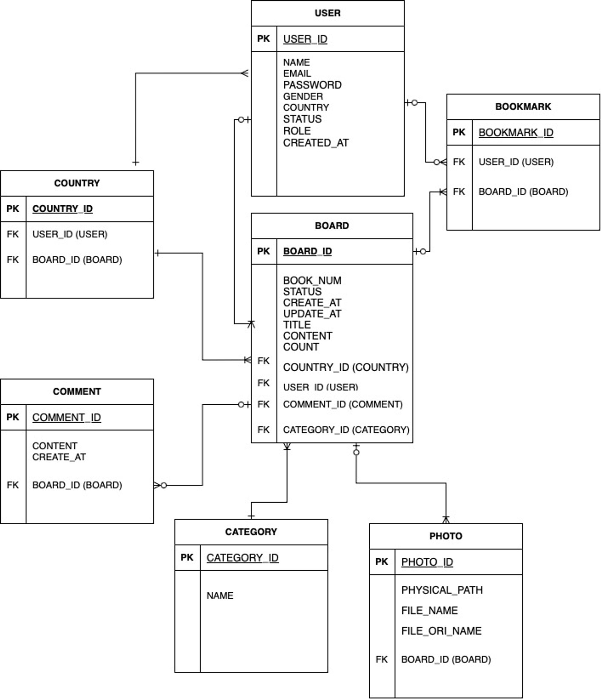

social networking website project

## 🖥 프로젝트 소개
해외 거주자들만을 위한 커뮤니티 프로젝트 입니다.

 

🗓 개발 기간

23.05.31 ~ 진행 중

## 👩 개발자

Soiiii
+ DB 테이블, 엔터티 설계, 통합 및 형상관리, 로그인, 회원가입, 마이페이지, 메인페이지, 즐겨찾기, 나라 별 게시판

 

## 📚 기술 스택

#### 프론트 엔드
+ Html

+ Css

+ JavaScript(Jquery)

+ Jsp

#### 백엔드
+ Spring Boot

+ Spring Data JPA

+ Spring Security

+ Mysql 

## 🛠 개발 환경

+ IntelliJ
+ Mysql WorkBench

## ▶ 주요 기능

#### 로그인
- 아이디 & 비밀번호 검증

#### 회원가입
- 아이디 중복 체크
- 닉네임 중복 체크
- 비밀번호 확인

#### 마이 페이지
- 회원정보 수정
- 즐겨찾기 리스트
- 작성글 리스트

#### 메인 페이지
- 나라 별 게시판 

#### 나라 별 게시판
- 모든 해외 거주민들의 게시판 페이징
- 각 나라 마다 게시판 페이징
  
#### 엔터티 설계

## 📝 회고

즐겨찾기 추가/취소 구현
+ https://capricious-iridium-70f.notion.site/d5a12822bb9e48e780f0d3bd5f4ab7ee
 
댓글 수정 기능 구현
 
+ https://capricious-iridium-70f.notion.site/b7f0b987e0cd453da124a70ee4417a8a
